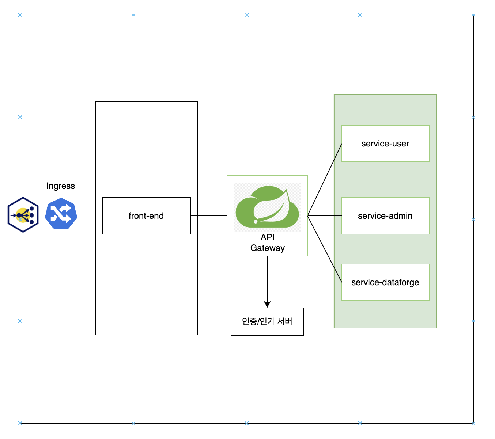

--------------------
# Java-spring-boot-security-jwt 6.3.3
--------------------

# 목차

- [문서 설명](#문서-설명)
  - [아키텍처 개요](#아키텍처-개요)
  - [Spring Gateway 를 이용한 인증/인가](#Spring_Gateway-를-이용한-인증/인가)
- [개발 환경 설정](#개발-환경-설정)
  - [공통 Gradle Version](#공통-Gradle-Version)
  - [server-gateway Gradle 수정](#server-gateway-Gradle-수정)
    - [server-gateway 구동 확인](#server-gateway-구동-확인)
  - [service-user Gradle 수정](#service-user-Gradle-수정)
    - [service-user 구동 확인](#service-user-구동-확인)
  - [server-gateway routes 설정](#server-gateway-routes-설정)
    - [server-gateway routes 구동 확인](#server-gateway-routes-구동-확인)
- [Spring Security Config](#Spring-Security-Config)

# 문서 설명

Spring Security와 Spring Gateway를 활용해 실무에서 인증/인가를 효과적으로 관리하는 방법을 설명하려고 합니다.  
이 방법은 인증/인가를 중앙에서 관리하고, 다른 어플리케이션은 비즈니스 로직에 집중할 수 있도록 역할을 분리하는 것이 핵심입니다.

## 아키텍처 개요  
먼저, Spring Gateway는 모든 요청을 중앙에서 받아들이고, 인증/인가를 처리한 후 해당 요청을 각 서비스로 전달하는 역할을 합니다.   
이렇게 함으로써 개별 서비스는 인증/인가 로직을 신경 쓰지 않고 자신이 담당하는 기능 구현에만 집중할 수 있습니다.  

## Spring Gateway 를 이용한 인증/인가  
- 인증(Authentication)
  - 클라이언트는 모든 요청을 Spring Gateway를 통해 전송합니다.
  - Gateway는 클라이언트의 인증 정보를 받아 JWT(Json Web Token) 등을 이용해 유효성을 검사합니다.
  - 인증에 성공하면, Gateway는 클라이언트의 요청을 내부 서비스로 라우팅합니다.

- 인가(Authorization):
  - Gateway는 각 요청이 어떤 리소스에 접근하려는지 확인하고, 해당 리소스에 대한 권한이 있는지 검증합니다.
  - 인가 정보는 JWT에 포함된 역할(Role)이나 권한(Authority) 정보를 기반으로 판단할 수 있습니다.
  - 인가가 완료된 요청만이 내부 서비스로 전달됩니다.

# 개발 환경 설정

[Spring 프로젝트 생성하기](https://start.spring.io/)  
Spring, Java 그리고 Gradle 버전만 설정 후 프로젝트를 생성합니다.  

## 공통 Gradle Version
**Gradle Version 관리 파일 생성**
~~~
$ cd gradle
$ touch libs.versions.toml
~~~

**libs.versions.toml 수정**
~~~
[versions]
springBoot = "3.3.3"
springDependency = "1.1.6"
springGateway = "4.1.5"
lombok = "1.18.28"

[libraries]
springGateway = { module = "org.springframework.cloud:spring-cloud-starter-gateway", version.ref = "springGateway" }
springWeb = { module = "org.springframework.boot:spring-boot-starter-web" }
lombok = { module = "org.projectlombok:lombok", version.ref = "lombok" }

[plugins]
springBoot = { id = "org.springframework.boot", version.ref = "springBoot" }
springDependency = { id = "io.spring.dependency-management", version.ref = "springDependency" }
~~~

## server-gateway Gradle 수정

**build.gradle 수정**
~~~
plugins {
	id 'java'
	alias(libs.plugins.springBoot)
	alias(libs.plugins.springDependency)
}

java {
	toolchain {
		languageVersion = JavaLanguageVersion.of(17)
	}
}

repositories {
	mavenCentral()
}

dependencies {
	// Lombok
	compileOnly libs.lombok
	annotationProcessor libs.lombok
	// Gateway
	implementation libs.springGateway
}

tasks.named('test') {
	useJUnitPlatform()
}

tasks.named('bootJar') {
	mainClass.set("com.study.security.GatewayApplication")
	archiveFileName = "app.jar"
}

tasks.named('jar') {
	enabled = true
}
~~~

### server-gateway 구동 확인
서버 실행 후 정상적으로 구동하는지 확인합니다.

## service-user Gradle 수정
**build.gradle 수정**
~~~
plugins {
	id 'java'
	alias(libs.plugins.springBoot)
	alias(libs.plugins.springDependency)
}

java {
	toolchain {
		languageVersion = JavaLanguageVersion.of(17)
	}
}

repositories {
	mavenCentral()
}

dependencies {
	// Lombok
	compileOnly libs.lombok
	annotationProcessor libs.lombok
	// Spring Web
	implementation libs.springWeb
}

tasks.named('test') {
	useJUnitPlatform()
}

tasks.named('bootJar') {
	mainClass.set("com.study.security.UserApplication")
	archiveFileName = "app.jar"
}

tasks.named('jar') {
	enabled = true
}
~~~

### service-user 구동 확인

> controller/UserController.class
~~~
@Slf4j
@RestController
@RequestMapping("/user")
public class UserController {

    @GetMapping
    public ResponseEntity<HttpStatus> get() {
        log.info("API OK");
        return ResponseEntity.ok(HttpStatus.OK);
    }
}
~~~

## server-gateway routes 설정
> server-gateway/resources/application.yaml
~~~
server:
  port: 9000

spring:
  application.name: ${SERVER_NAME:SERVER-GATEWAY}
  cloud.gateway:
    routes:
      - id: SERVICE-USER
        uri: ${uri.service.user}
        predicates:
          - Path=/user

uri.service.user: http://localhost:9010
~~~

### server-gateway routes 구동 확인

server-gateway , service-user 어플리케이션을 동시에 가동 후  
gateway 의 routes 등록된 Path 로 API 통신을 확인합니다.  

http://localhost:9000/user 통신 후 UserApplication 에서 로그가 출력되면 됩니다.

# Spring Security Config

기본적으로 JWT(Json Web Token) 을 활용할겁니다,.