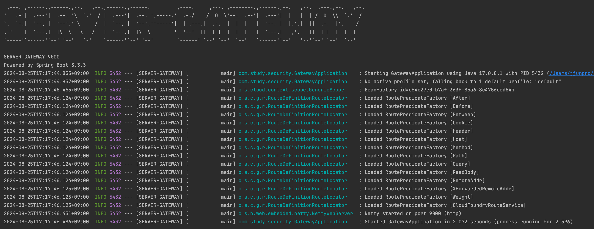
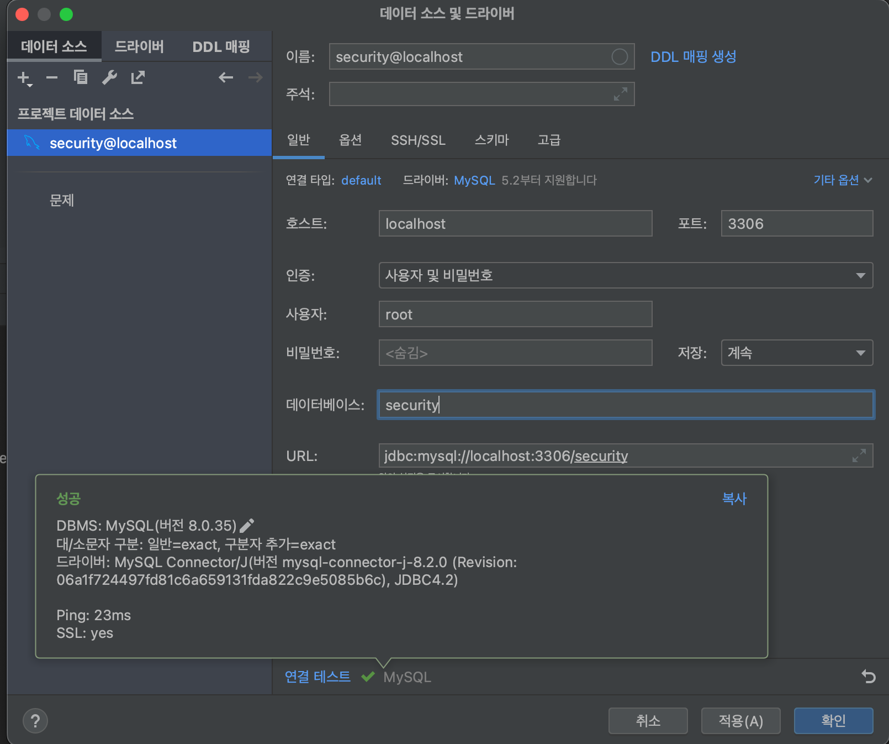

--------------------
# Java-spring-boot-security-jwt 6.3.3
--------------------

# 목차

- [문서 설명](#문서-설명)
  - [아키텍처 개요](#아키텍처-개요)
  - [Spring Gateway 를 이용한 인증/인가](#Spring_Gateway-를-이용한-인증/인가)
- [JWT (JSON Web Token) 이란?](#JWT-(JSON-Web-Token)-이란?)
  - [oauth 인증 그리고 JWT와 같은 Claim 기반의 토큰 흐름](#oauth-인증-그리고-JWT와-같은-Claim-기반의-토큰-흐름)
  - [JWT와 같은 Claim 기반의 토큰 흐름](#JWT와-같은-Claim-기반의-토큰-흐름)
  - [많은 프로그래밍 언어의 지원](#많은-프로그래밍-언어의-지원)
  - [자가 수용적 (self_contained)](#자가-수용적-(self_contained))
  - [쉬운 전달](#쉬운-전달)
  - [Claim (메시지) 기반](#Claim-(메시지)-기반)
  - [JWT의 문제점](#JWT의-문제점)
  - [JWT를 유용하게 사용하는 상황](#JWT를-유용하게-사용하는-상황)
  - [JWT 코드의 구조](#JWT-코드의-구조)
    - [헤더 Header](#헤더-Header)
    - [정보 Payload](#정보-Payload)
    - [서명 (signature)](#서명-(signature))
- [개발 환경 설정](#개발-환경-설정)
  - [공통 Gradle Version](#공통-Gradle-Version)
  - [server-gateway Gradle 수정](#server-gateway-Gradle-수정)
    - [server-gateway 구동 확인](#server-gateway-구동-확인)
  - [service-user Gradle 수정](#service-user-Gradle-수정)
    - [service-user 구동 확인](#service-user-구동-확인)
  - [server-gateway routes 설정](#server-gateway-routes-설정)
    - [server-gateway routes 구동 확인](#server-gateway-routes-구동-확인)
  - [Docker MySQL Install](#Docker-MySQL-Install)
- [Spring Security Config](#Spring-Security-Config)
- [회원가입 구현](#회원가입-구현)
  - [회원가입 테스트](#회원가입-테스트)

# 문서 설명

Spring Security와 Spring Gateway를 활용해 실무에서 인증/인가를 효과적으로 관리하는 방법을 설명하려고 합니다.  
이 방법은 인증/인가를 중앙에서 관리하고, 다른 어플리케이션은 비즈니스 로직에 집중할 수 있도록 역할을 분리하는 것이 핵심입니다.

## 아키텍처 개요  
먼저, Spring Gateway는 모든 요청을 중앙에서 받아들이고, 인증/인가를 처리한 후 해당 요청을 각 서비스로 전달하는 역할을 합니다.   
이렇게 함으로써 개별 서비스는 인증/인가 로직을 신경 쓰지 않고 자신이 담당하는 기능 구현에만 집중할 수 있습니다.  

## Spring Gateway 를 이용한 인증/인가  
- 인증(Authentication)
  - 클라이언트는 모든 요청을 Spring Gateway를 통해 전송합니다.
  - Gateway는 클라이언트의 인증 정보를 받아 JWT(Json Web Token) 등을 이용해 유효성을 검사합니다.
  - 인증에 성공하면, Gateway는 클라이언트의 요청을 내부 서비스로 라우팅합니다.

- 인가(Authorization):
  - Gateway는 각 요청이 어떤 리소스에 접근하려는지 확인하고, 해당 리소스에 대한 권한이 있는지 검증합니다.
  - 인가 정보는 JWT에 포함된 역할(Role)이나 권한(Authority) 정보를 기반으로 판단할 수 있습니다.
  - 인가가 완료된 요청만이 내부 서비스로 전달됩니다.

# JWT (JSON Web Token) 이란?

JSON Web Token (JWT) 은 웹표준 [(RFC 7519)](https://tools.ietf.org/html/rfc7519) 으로서  
두 개체에서 JSON 객체를 사용하여 가볍고 자가수용적인 (self-contained) 방식으로 정보를 안전성 있게 전달해줍니다.

JSON 객체로서 안전하게 정보를 전송할 수 있는 작고 self-contained 방법을 정의하는 표준이다.  
JWT 대표적인 특징으로는 Claim 기반 토큰의 개념 이라는 것입니다.

- OAuth 인증방식의 경우
  - OAuth에 의해서 발급되는 access_token은 random string으로 토큰 자체에는 특별한 정보를 가지고 있지 않는 일반적인 스트링 형태입니다.

API나 서비스를 제공하는 서버 입장에서 그 access_token을 통해서 사용자에 연관된 권한(예를 들어 scope같은 것)을 식별한 뒤 권한을 허용해주는 구조입니다.  
즉 서비스를 제공하는 입장에서는 토큰을 가지고 그 토큰과 연관된 정보를 서버쪽에서 찾아야 합니다. (사용자 ID나 권한 등)

JWT는 Claim 기반이라는 방식을 사용하는데, `Claim이라는 사용자에 대한 프로퍼티나 속성`을 이야기 합니다.  
토큰 자체가 정보를 가지고 있는 방식인데, JWT는 이 Claim을 JSON을 이용해서 정의 합니다.

## oauth 인증 그리고 JWT와 같은 Claim 기반의 토큰 흐름

- 1.
  - API 클라이언트가 `Authorization Server(토큰 발급서버)로 토큰을 요청`합니다. 이때, 토큰 발급을 요청하는 사용자의 계정과 비밀번호를 넘기고,
    `이와 함께 토큰의 권한(용도)를 요청`합니다.
  - 여기서는 일반 사용자 권한(enduser)과 관리자 권한(admin)을 같이 요청하였습니다.
- 2.
  - 토큰 생성 요청을 받은 `Authorization Server는 사용자 계정을 확인한 후, 이 사용자에게 요청된 권한을 부여해도 되는지 계정 시스템 등에 물어본 후,
    사용자에게 해당 토큰을 발급이 가능하면 토큰을 발급하고, 토큰에 대한 정보를 내부(토큰 저장소)에 저장`해 둡니다.
- 3.
  - 이렇게 생성된 토큰은 API 클라이언트로 저장이 됩니다.
- 4.
  - API 클라이언트는 API를 호출할때 이 `토큰을 이용해서 Resource Server(API 서버)에 있는 API를 호출`합니다.
- 5.
  - 이때 호출되는 API는 관리자 권한을 가지고 있어야 사용할 수 있기 때문에, Resource Server가 토큰 저장소에서 토큰에 관련된 사용자 계정,
    권한 등의 정보를 가지고 옵니다. 이 토큰에 `(관리자)admin 권한이 부여되어 있기 때문에, API 호출을 허용`합니다.
  - 위에 정의한 시나리오에서는 그 사용자가 속한 "회사"의 사용자 정보만 조회할 수 있습니다.
  - 라는 전제 조건을 가지고 있기 때문에 API 서버는 추가로 사용자 데이터베이스에서 이 사용자가 속한 "회사" 정보를 찾아와야 합니다.
- 6.
  - API 서버는 응답을 보냅니다.

## JWT와 같은 Claim 기반의 토큰 흐름

- 1. 토큰을 생성 요청하는 방식은 동일합니다. 마찬가지로 `사용자를 인증한 다음에 토큰을 생성`합니다.
- 2. 다른 점은 생성된 토큰에 관련된 정보를 별도로 저장하지 않는다는 것입니다. `토큰에 연관되는 사용자 정보나 권한 등을 토큰 자체에 넣어서 저장`합니다.
- 3. API를 호출하는 방식도 동일합니다.
- 4. Resource Server (API 서버)는 `토큰 내에 들어있는 사용자 정보를 가지고 권한 인가 처리를 하고 결과를 리턴`합니다.

결과적으로 차이점은 토큰을 생성하는 단계에서는 `생성된 토큰을 별도로 서버에서 유지할 필요가 없으며` 토큰을 사용하는 API 서버 입장에서는  
API 요청을 검증하기 위해서 토큰을 가지고 사용자 정보를 별도로 계정 시스템 등에서 조회할 필요가 없습니다.

## 많은 프로그래밍 언어의 지원

JWT 는 C, Java, Python, C++, R, C#, PHP, JavaScript, Ruby, Go, Swift 등 대부분의 주류 프로그래밍 언어에서 지원됩니다.

## 자가 수용적 (self_contained)

JWT 는 `필요한 모든 정보를 자체적으로` 지니고 있습니다.  
JWT 시스템에서 발급된 토큰은, `토큰에 대한 기본정보` 그리고 `전달 할 정보` (로그인시스템에서는 유저 정보) 그리고 토큰이 `검증됐다는것을 증명해주는 signature` 를 포함하고있습니다.

## 쉬운 전달

JWT 는 자가수용적이므로, 두 개체 사이에서 손쉽게 전달 될 수 있습니다. 웹서버의 경우 HTTP의 헤더에 넣어서 전달 할 수도 있고, URL 의 파라미터로 전달 할 수도 있습니다.

## Claim (메시지) 기반

JWT는 Claim를 JSON형태로 표현하는 것인데,
JSON은 "\n"등 개행문자가 있기 때문에, REST API 호출시 HTTP Header등에 넣기가 매우 불편합니다.
그래서, JWT에서는 이 Claim JSON 문자열을 BASE64 인코딩을 통해서 하나의 문자열로 변환합니다.

- 대표적으로 변조 방지
  메세지가 변조되지 않았음을 증명하는 것을 무결성(Integrity)라고 하는데,
  무결성을 보장하는 방법 중 많이 사용되는 방법이 서명(Signature)이나 HMAC을 사용하는 방식입니다

즉 원본 메시지에서 해쉬값을 추출한 후, 이를 비밀 키를 이용해서 복호화 시켜서 토큰의 뒤에 붙입니다. 이게 HMAC방식인데, 누군가 이 메시지를 변조를 했다면, 변조된 메시지에서 생성한 해쉬값과 토큰 뒤에 붙어있는 HMAC 값이 다르기 때문에 메시지가 변조되었음을 알 수 있습니다. 다른 누군가가 메시지를 변조한 후에, 새롭게 HMAC 값을 만들어내려고 하더라도, HMAC은 앞의 비밀키를 이용해서 복호화 되었기 때문에, 이 비밀키를 알 수 없는 이상 HMAC을 만들어 낼 수 없습니다.

## JWT의 문제점

- 1. 길이
  - Claim에 넣는 데이터가 많아질수록, JWT 토큰의 길이가 길어집니다.
  - API 호출등에 사용할 시에, 매 호출마다 헤더에 붙어서 가야하기 때문에, 길이가 길다는 것은 그만큼 네트워크 대역폭 낭비가 심하다는 의미입니다.

- 2. 한번 발급된 토큰은 값을 수정하거나 폐기가 불가
  - JWT는 토큰 내에 모든 정보를 다 가지고 있기 때문에, 한번 발급된 토큰에 대한 변경은 서버에서는 더이상 불가능합니다.
  - 예를 들어 토큰을 잘못 발행해서 삭제하고 싶더라도, Sinagture만 맞으면 맞는 토큰으로 인식을 하기 때문에, 서버에는 한번 발급된 토큰의 정보를 바꾸는 일등이 불가능합니다.
  - 그래서 만약에 JWT를 쓴다면, Expire time을 꼭 명시적으로 두도록하고, refresh token등을 이용해서, 중간중간 토큰을 재발행하도록 해야합니다.

- 3. 보안
  - JWT는 기본적으로 Claim에 대한 정보를 암호화하지 않는다. 단순히 BASE64로 인코딩만 하기 때문에, 중간에 패킷을 가로채거나,
    기타 방법으로 토큰을 취득했으면 토큰 내부 정보를 통해서 사용자 정보가 누출 될 수 있는 가능성이 있습니다.
  - 특히 자바스크립트 기반의 웹 클라이언트의 경우 브라우저상의 디버거등을 통해서 토큰이 노출될 가능성이 높습니다.
  - 그래서, 이를 보완하는 방법으로는 토큰 자체를 암호화하는 방법이 잇습니다. JSON을 암호화하기 위한 스펙으로는 JWE(JSON Web Encryption)이 있습니다.

## JWT를 유용하게 사용하는 상황

- 회원 인증

JWT 를 사용하는 가장 흔한 경우 회원 인증 입니다.  
유저가 로그인을 하면, 서버는 `유저의 정보에 기반한 토큰을 발급하여 유저에게 전달`해줍니다.  
그 후, `유저가 서버에 요청을 할 때 마다 JWT를 포함하여 전달`합니다.  
서버가 클라이언트에게서 요청을 받을때 마다, `해당 토큰이 유효하고 인증됐는지 검증`을 하고,  
유저가 요청한 작업에 권한이 있는지 확인하여 작업을 처리합니다.  
중요! `서버측에서는 유저의 세션을 유지 할 필요가 없습니다.`  
즉 유저가 로그인되어있는지 안되어있는지 신경 쓸 필요가 없고,  
유저가 요청을 했을때 `토큰만 확인`하면 되니, 세션 관리가 필요 없어서 `서버 자원을 많이 아낄 수 있다.`

- 정보 교류

JWT는 두 개체 사이에서 `안정성있게 정보를 교환하기에 좋은 방법`입니다.  
그 이유는, 정보가 sign 이 되어있기 때문에 정보를 보낸이가 바뀌진 않았는지,  
또 `정보가 도중에 조작되지는 않았는지 검증`할 수 있습니다.

## JWT 코드의 구조

JWT 는 . 을 구분자로 `3가지의 문자열`로 되어있습니다. 구조는 다음과 같이 이루어져있습니다

aaa.bbb.ccc -> header.payload.signature

(헤더, 내용, 서명) 순으로 이루어있는 문자열 입니다.

### 헤더 Header

Header는 두가지 정보를 지니고 있습니다.

- typ : 토큰의 타입을 지정합니다.
- alg : 해싱 알고리즘을 지정합니다. 해싱 알고리즘은 보통 HMAC SHA256 혹은 RSA가 사용되며 토큰을 검증 할 때 사용되는 signature 부분에서 사용됩니다.

### 정보 Payload

Payload 부분에는 `토큰에 담을 정보`가 들어있습니다.  
여기에 담는 정보의 한 `‘조각’ 을 클레임(claim)` 이라고 부르고,  
이는 name / value 의 한 쌍으로 이뤄져있습니다.  
토큰에는 여러개의 클레임 들을 넣을 수 있습니다.

클레임 의 종류는 다음과 같이 크게 세 분류로 나뉘어져있습니다.

- 등록된 (registered) 클레임
- 공개 (public) 클레임
- 비공개 (private) 클레임

#### 등록된 (registered) 클레임

등록된 클레임들은 서비스에서 필요한 정보들이 아닌,  
토큰에 대한 정보들을 담기위하여 이름이 이미 정해진 클레임들입니다.  
등록된 클레임의 `사용은 모두 선택적 (optional)`이며,  
이에 포함된 클레임 이름들은 다음과 같습니다.

- iss: 토큰 발급자 (issuer)
- sub: 토큰 제목 (subject)
- aud: 토큰 대상자 (audience)
- exp: 토큰의 만료시간 (expiraton), 시간은 NumericDate 형식으로 되어있어야 하며 (예: 1480849147370) 언제나 `현재 시간보다 이후`로 설정되어있어야합니다.
- nbf: Not Before 를 의미하며, 토큰의 활성 날짜와 비슷한 개념입니다. 여기에도 NumericDate 형식으로 날짜를 지정하며, `이 날짜가 지나기 전까지는 토큰이 처리되지 않습니다.`
- iat: 토큰이 발급된 시간 (issued at), 이 값을 사용하여 `토큰의 age 가 얼마나 되었는지 판단` 할 수 있습니다.
- jti: JWT의 고유 식별자로서, 주로 `중복적인 처리를 방지`하기 위하여 사용됩니다. 일회용 토큰에 사용하면 유용합니다.

#### 공개 (public) 클레임

공개 클레임들은 `충돌이 방지된 (collision-resistant)` 이름을 가지고 있어야 합니다.  
충돌을 방지하기 위해서는, `클레임 이름을 URI 형식`으로 짓습니다.

~~~
{
    "http://localhost:3000/boardEvent/write": true
}
~~~

#### 비공개 (private) 클레임

등록된 클레임도아니고, 공개된 클레임들도 아닙니다.  
양 측간에 (보통 클라이언트 <->서버) 협의하에 사용되는 클레임 이름들입니다.  
공개 클레임과는 달리 이름이 중복되어 충돌이 될 수 있으니 사용할때에 유의해야합니다.

~~~
{
    "username": "jjunpro"
}
~~~

결국 JWT Token 을 전체적으로 확인해보면

~~~
{
    "iss": "admin",
    "exp": "148794004800",
    "http://localhost:3000/boardEvent/write": true,
    "userId": "38048322648",
    "username": "jjunpro"
}
~~~

이런 형식의 토큰 코드가 완성됩니다.

### 서명 (signature)

JSON Web Token 의 마지막 부분은 바로 서명(signature) 입니다.  
이 서명은 `헤더의 인코딩값`과, `정보의 인코딩값`을 합친 후 주어진 비밀키로 해쉬를 하여 생성합니다.

# 개발 환경 설정

[Spring 프로젝트 생성하기](https://start.spring.io/)  
Spring, Java 그리고 Gradle 버전만 설정 후 프로젝트를 생성합니다.  

## 공통 Gradle Version
**Gradle Version 관리 파일 생성**
~~~
$ cd gradle
$ touch libs.versions.toml
~~~

**libs.versions.toml 수정**
~~~
[versions]
lombok = "1.18.28"
springBoot = "3.3.3"
springDependency = "1.1.6"
gateway = "4.1.5"
r2dbcMysql = "1.3.0"

[libraries]
lombok = { module = "org.projectlombok:lombok", version.ref = "lombok" }
gateway = { module = "org.springframework.cloud:spring-cloud-starter-gateway", version.ref = "gateway" }
web = { module = "org.springframework.boot:spring-boot-starter-web" }
security = { module = "org.springframework.boot:spring-boot-starter-security" }
r2dbc = { module = "org.springframework.boot:spring-boot-starter-data-r2dbc" }
r2dbcMysql = { module = "io.asyncer:r2dbc-mysql", version.ref = "r2dbcMysql" }

[plugins]
springBoot = { id = "org.springframework.boot", version.ref = "springBoot" }
springDependency = { id = "io.spring.dependency-management", version.ref = "springDependency" }

~~~

## server-gateway Gradle 수정

**build.gradle 수정**
~~~
plugins {
	id 'java'
	alias(libs.plugins.springBoot)
	alias(libs.plugins.springDependency)
}

java {
	toolchain {
		languageVersion = JavaLanguageVersion.of(17)
	}
}

repositories {
	mavenCentral()
}

dependencies {
	// Lombok
	compileOnly libs.lombok
	annotationProcessor libs.lombok
	// Gateway
	implementation libs.gateway
	// Security
	implementation libs.security
	// R2DBC
	implementation libs.r2dbc
	implementation libs.r2dbcMysql
}

tasks.named('test') {
	useJUnitPlatform()
}

tasks.named('bootJar') {
	mainClass.set("com.study.security.GatewayApplication")
	archiveFileName = "app.jar"
}

tasks.named('jar') {
	enabled = true
}
~~~

### server-gateway 구동 확인
서버 실행 후 정상적으로 구동하는지 확인합니다.

## service-user Gradle 수정
**build.gradle 수정**
~~~
plugins {
	id 'java'
	alias(libs.plugins.springBoot)
	alias(libs.plugins.springDependency)
}

java {
	toolchain {
		languageVersion = JavaLanguageVersion.of(17)
	}
}

repositories {
	mavenCentral()
}

dependencies {
	// Lombok
	compileOnly libs.lombok
	annotationProcessor libs.lombok
	// Spring Web
	implementation libs.web
}

tasks.named('test') {
	useJUnitPlatform()
}

tasks.named('bootJar') {
	mainClass.set("com.study.security.UserApplication")
	archiveFileName = "app.jar"
}

tasks.named('jar') {
	enabled = true
}
~~~

### service-user 구동 확인

> controller/UserController.class
~~~
@Slf4j
@RestController
@RequestMapping("/user")
public class UserController {

    @GetMapping
    public ResponseEntity<HttpStatus> get() {
        log.info("API OK");
        return ResponseEntity.ok(HttpStatus.OK);
    }
}
~~~

## server-gateway routes 설정
> server-gateway/resources/application.yaml
~~~
server:
  port: 9000

spring:
  application.name: ${SERVER_NAME:SERVER-GATEWAY}
  cloud.gateway:
    routes:
      - id: SERVICE-USER
        uri: ${uri.service.user}
        predicates:
          - Path=/user

uri.service.user: http://localhost:9010
~~~

### server-gateway routes 구동 확인

server-gateway , service-user 어플리케이션을 동시에 가동 후  
gateway 의 routes 등록된 Path 로 API 통신을 확인합니다.  

http://localhost:9000/user 통신 후 UserApplication 에서 로그가 출력되면 됩니다.

## DB Connection
### Docker MySQL Install
> docker-compose.yaml
~~~
$ docker-compose up -d
~~~

### R2DBC Config
> server-gateway/config/R2dbcConfig.class
~~~
@Configuration
@EnableR2dbcAuditing
public class R2dbcConfig extends AbstractR2dbcConfiguration {

    @Bean(name = "dataSource")
    @ConfigurationProperties("spring.datasource.hikari")
    @Override
    public ConnectionFactory connectionFactory() {
        return ConnectionFactories.get(ConnectionFactoryOptions.builder()
                .option(ConnectionFactoryOptions.DRIVER, "mysql")
                .option(ConnectionFactoryOptions.HOST, "localhost")
                .option(ConnectionFactoryOptions.PORT, 3306)
                .option(ConnectionFactoryOptions.DATABASE, "security")
                .option(ConnectionFactoryOptions.USER, "root")
                .option(ConnectionFactoryOptions.PASSWORD, "root")
                .option(Option.valueOf("serverZoneId"), ZoneId.of("Asia/Seoul"))
                .build());
    }
}
~~~

# Spring Security Config
> server-gateway/config/SecurityConfig.class
~~~
@Configuration
@EnableWebFluxSecurity
public class SecurityConfig {

    @Bean
    SecurityWebFilterChain securityWebFilterChain(ServerHttpSecurity http) {
        return http
                .httpBasic(ServerHttpSecurity.HttpBasicSpec::disable)
                .formLogin(ServerHttpSecurity.FormLoginSpec::disable)
                .csrf(ServerHttpSecurity.CsrfSpec::disable)
                .cors(ServerHttpSecurity.CorsSpec::disable)
                .addFilterAfter(this.corsWebFilter(), SecurityWebFiltersOrder.CORS)
                .build();
    }

    @Bean
    public CorsWebFilter corsWebFilter() {
        CorsConfiguration configuration = new CorsConfiguration();
        configuration.setAllowCredentials(true);
        configuration.setAllowedOriginPatterns(Collections.singletonList("*"));
        configuration.setAllowedHeaders(Collections.singletonList("*"));
        configuration.setAllowedMethods(Arrays.asList(HEAD.name(), GET.name(), POST.name(), PUT.name(), DELETE.name(), OPTIONS.name()));
        configuration.setMaxAge(3600L);
        UrlBasedCorsConfigurationSource source = new UrlBasedCorsConfigurationSource();
        source.registerCorsConfiguration("/**", configuration);
        return new CorsWebFilter(source);
    }

    @Bean
    PasswordEncoder passwordEncoder() {
        return new BCryptPasswordEncoder();
    }
}
~~~
기본적으로 JWT(Json Web Token) 을 사용할겁니다.  

- HTTP Basic Authentication (httpBasic) 비활성화
  - HTTP Basic Authentication은 클라이언트가 요청할 때마다 사용자 이름과 비밀번호를 Base64로 인코딩하여 전송하는 매우 간단한 인증 방식입니다. 
  - 그러나 JWT를 사용하는 경우, 인증이 이미 JWT 토큰을 통해 처리됩니다. 따라서 HTTP Basic Authentication은 불필요하며, 보안상의 이유로 이를 비활성화합니다.
- Form-based Authentication (formLogin) 비활성화
  - Form-based Authentication은 웹 애플리케이션에서 일반적으로 사용되는 로그인 폼을 제공하는 인증 방식입니다. 
  - 그러나 JWT 기반 인증은 클라이언트가 로그인한 후 JWT 토큰을 발급받아 이후 요청 시 해당 토큰을 사용하여 인증을 처리하는 방식입니다. 
  - 따라서 로그인 폼이 필요 없으며, Form-based Authentication을 비활성화하여 시스템 복잡성을 줄이고 보안을 강화합니다.
- Cross-Site Request Forgery (csrf) 비활성화
  - CSRF는 사용자가 의도하지 않은 요청을 보내는 공격 기법입니다. 
  - 일반적으로 CSRF 보호를 위해 사이트는 서버에서 생성한 CSRF 토큰을 사용합니다. 
  - 하지만 JWT 기반의 애플리케이션에서는 상태가 없는 인증 방식을 사용하기 때문에, 서버 측 세션 상태가 없습니다. 
  - 클라이언트는 각 요청 시 JWT를 보내므로, CSRF 공격에 대한 위험이 낮습니다. 따라서 JWT를 활용하는 애플리케이션에서는 CSRF 보호가 불필요하며 이를 비활성화할 수 있습니다.
- Cross-Origin Resource Sharing (cors) 비활성화
  - CORS는 웹 페이지가 다른 도메인에서 리소스를 요청할 때 발생하는 보안 문제를 다루기 위한 메커니즘입니다. 
  - 여기서는 CORS 설정을 비활성화하고, 대신 커스텀 corsWebFilter를 추가하고 있습니다. 
  - 이는 기본적인 CORS 설정 대신, 사용자 정의된 필터를 통해 CORS 설정을 더 세밀하게 제어하기 위함입니다.

# 회원가입 구현
> sql/schema.sql

USER 테이블을 생성합니다. 

>server-gateway/UserRequestDTO.class
~~~
@Builder
@Getter @Setter
public class UserRequestDTO {
    private String username;
    private String password;
    private String roleName;
}
~~~

> server-gateway/UserResponseDTO.class
~~~
@Builder
@Getter @Setter
public class UserResponseDTO {
    private String username;
    private String roleName;
}
~~~

> server-gateway/MemberController.class
~~~
@RestController
@RequestMapping("/user")
@RequiredArgsConstructor
public class MemberController {

    private final UserService userService;

    @PostMapping("/join")
    public Mono<UserResponseDTO> join(
            @RequestBody
            Mono<UserRequestDTO> userRequestDTO
    ) {
        return userService.join(userRequestDTO);
    }
}
~~~

> server-gateway/UserService.class
~~~
@Slf4j
@Service
@RequiredArgsConstructor
public class UserService {

    private final PasswordEncoder passwordEncoder;
    private final UserRepository userRepository;

    public Mono<UserResponseDTO> join(Mono<UserRequestDTO> userRequestDTOMono) {
        return userRequestDTOMono.flatMap(this::createUser);
    }

    public Mono<UserResponseDTO> createUser(UserRequestDTO dto) {
        dto.setPassword(this.passwordEncoder.encode(dto.getPassword()));
        return this.userRepository.save(
                        UserEntity.builder()
                                .username(dto.getUsername())
                                .password(dto.getPassword())
                                .roleName(dto.getRoleName())
                                .build()
                )
                .flatMap(entity -> Mono.just(UserResponseDTO.builder()
                        .username(entity.getUsername())
                        .roleName(entity.getRoleName())
                        .build()
                ))
                .onErrorResume(error -> {
                    log.error("Create User Error {}", error.getMessage());
                    return Mono.error(new ResponseStatusException(HttpStatus.BAD_REQUEST, "Create User Error"));
                })
                ;
    }
}
~~~

> server-gateway/UserEntity.class
~~~
@Getter
@Builder
@Table("USER")
@JsonNaming(value = PropertyNamingStrategies.SnakeCaseStrategy.class)
public class UserEntity {

    @Id
    private Long id;

    private String username;

    private String password;

    private String roleName;

    @CreatedDate
    private LocalDateTime createDt;

    @LastModifiedDate
    private LocalDateTime updateDt;
}
~~~

> server-gateway/UserRepository.class
~~~
@Repository
public interface UserRepository extends ReactiveCrudRepository<UserEntity, Long> { }
~~~

## 회원가입 테스트
**Request**
~~~
http://localhost:9000/user/join

{
    "username": "jjunpro",
    "password": "123123",
    "roleName": "ROLE_ADMIN"
}
~~~

**Response**
~~~
{
    "username": "jjunpro",
    "roleName": "ROLE_ADMIN"
}
~~~